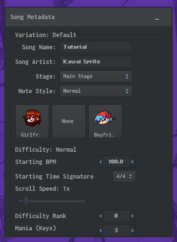
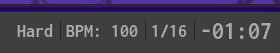

# Documentation

### Definitions:
- VSEK: **V**-**S**lice **E**xtra **K**eys

## Charts

VSEK charts (`-chart.json` files) are basic .fnfc supported charts, but they now have a new property named `keys`. Similar to `scrollSpeed`, it controls the ammount of mania for each difficulty.

### Remarks:
- Supports `default`, so key ammounts are synchronizable to all difficulties if they don't have one asigned.
- Supports variants, like `scrollSpeed`.
- Is not tied to metadata.

### Proper use

- When loading a non-VSEK chart (FNF Chart), the `keys` property will set `default` to `3`.
- [SOON] When importing/migrating a **Legacy FNF** chart with a `mania` property, the `keys` property will set the default import difficulty `normal` to that chart's `mania`.
  - Read more [here](#importing-fnf-legacy-charts-with-mania)
- These charts keep the same semantic versions as the original FNF Chart format, but they may not be compatible with original base game builds.
- Changing the mania manually via **Chart Editor**
  - Read more [here](#change-mania)

### Change mania

**Change the mania by editing the file only when needed.**

A stepper is provided within the **Metadata Properties** toolbox, located in the **Window** tab of the Chart Editor:

Like normal, changing the difficulty via the provided button on the **bottom** of the **Chart Editor**, also changes the mania to the one of that difficulty or sets it to `3` if none is asigned to that difficulty.

## Importing FNF Legacy charts with mania
[SOON]

**Do not use a chart converting tool, these normally don't support mania.**

When opening the **Welcome Dialog** in the **Help** tab, or selecting **New Chart** on the **File** tab, you can import these legacy formats:
- **FNF Legacy** charts (No mania)
- **FNF Legacy - Shaggy** charts:
  - `mania: 0` 4 Keys
  - `mania: 1` 6 Keys
  - `mania: 2` 7 Keys
  - `mania: 3` 9 Keys
- **FNF Legacy - Psych Engine with Extra Keys**
- **FNF Legacy - Leather Engine**

along with **FNF Legacy**, which assumes you do not have a `mania` value, and defaults it to `3`.

The `keys` property will asign the default difficulty to the Legacy chart's `mania`, suggesting you selected the format it is in.

### Change mania (Event)

Not planned (yet)

### Script support

Not planned (yet)
